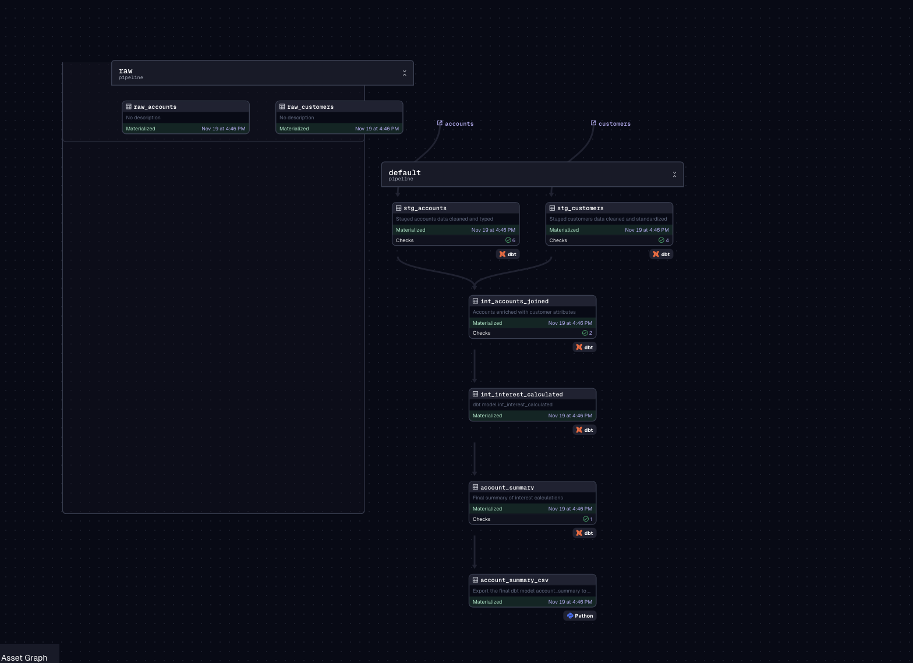
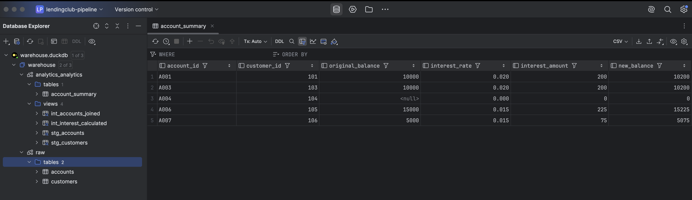

## 📌 Project Overview

This project implements a fully containerized local data pipeline that:
	1.	Ingests raw CSV files into DuckDB using Dagster assets
	2.	Transforms data using dbt (staging, intermediate, marts layers)
	3.	Runs data quality tests at multiple layers
	4.	Materializes final reporting tables
	5.	Outputs final CSV artifact locally and is connected to DataGrip to explore tables
	6.	Runs end-to-end using Docker Compose, no local dependencies required.

The pipeline has three major components:
	•	Ingestion — Dagster assets (raw_accounts, raw_customers)
	•	Transformation — dbt models (staging, intermediate, marts)
	•	Orchestration — A Dagster job that runs all assets sequentially


### What the pipeline Does: 

1. Ingest raw source data into DuckDB (Ligh weighted Database)

	Dagster assets (raw_accounts, raw_customers) read raw CSV files from the local filesystem and load them into a DuckDB analytical database.
	This establishes the foundation for all downstream transformations.

2. Transform data across dbt layers (Staging → Intermediate → Marts)
	•	Staging layer (stg_*)
		Cleans, normalizes, and enforces typing on source data.
	•	Intermediate layer (int_*)
		Enriches and joins data across source systems.
	•	Marts layer (account_summary)
		Produces final business-facing reporting tables.

3. Run extensive data quality tests at every modeling layer
	The project includes built-in dbt tests such as:
	•	not_null
	•	unique
	•	accepted_values
	•	relationships (foreign key enforcement)

	These tests ensure upstream data consistency and downstream reliability.

4. Output final artifact as a CSV file
	A Dagster asset (account_summary_csv) exports the final table into a local directory (e.g. output/), making the results easy to inspect, share, or load elsewhere.

5. Full pipeline orchestration via Dagster (Sequential Execution)
	A Dagster job orchestrates the entire workflow:
	•	Ensures assets run in the correct order
	•	Enforces sequential execution to prevent DuckDB concurrency locks
	•	Provides UI visibility into pipeline runs via Dagster Web UI

	Users can run the entire pipeline with: 'docker compose up --build'

6.  Why This Pipeline Is Valuable
•	Portable — Entire stack runs in Docker; no local Python/dbt installations required
•	Tested — Strong data tests ensure reliability
•	Extensible — Add models, tests, sources, jobs easily
•	Modern — Uses best practices from the modern data stack: DuckDB + dbt + Dagster
•	Automated — One command to run full ingestion, transformations, validation, export


### Pipeline Flow



### Final Results viewed in Datagrip



------------------------------------------------------------------------------------------------------------------------------------------------------------------

### 🚀 Running the Pipeline 

Prerequisites
	•	Docker Desktop installed (Mac, Windows, Linux)
	•	No local Python/dbt/Dagster needed


1. Build and Start the Pipeline

docker compose down -v
docker compose up --build

Dagster UI is exposed at: http://localhost:3000


2. Run the Full Pipeline

In Dagster UI:
Jobs → pipeline_job → Launch Run


Note - All the pipeline run images and docker run images are stored in the images directory.

------------------------------------------------------------------------------------------------------------------------------------------------------------------


### 🧩 Pipeline Components

🔹 1. Ingestion (Dagster)

raw_accounts

Reads data/accounts.csv into DuckDB → raw.accounts

raw_customers

Reads data/customers.csv into DuckDB → raw.customers


🔹 2. dbt Transformations

- Staging Layer
	•	Type casting
	•	Normalization (trim, lowercase)
	•	Schema tests

   Key tests:
	•	not_null on PKs and required fields
	•	Relationships: stg_accounts.customer_id → stg_customers.customer_id
	•	Accepted values: account_type ∈ { checking, savings }

- Intermediate Layer

int_accounts_joined
	•	Joins accounts with customers

- Marts Layer

account_summary
	•	Final reporting table
	•	Materialized as table


📤 Output Files

When the pipeline completes we generate: output/account_summary.csv


------------------------------------------------------------------------------------------------------------------------------------------------------------------


### 📌 Assumptions Made

Data Assumptions
•	All AccountID and CustomerID represent unique identifiers.
•	Balance may be null in raw files → replaced with 0 during staging.(Normalized and assumed as zero )
	    If raw Balance is NULL, system treats it as 0 because the downstream interest calculation requires a numeric value. Balances can be negative as well, and the coalesce(..., 0) was added only to avoid dbt test failures. It does not imply that negative balances are disallowed.
•	AccountType contains messy values → normalized to lowercase + trimmed.
•	has_loan may be missing or None → accepted values include null.

Modeling Assumptions
•	customer_id is always the join key.
•	Staging layer should only clean and cast fields (no business logic).
•	Intermediate layer handles enrichment.
•	Marts layer produces final aggregates/tables.

Test Assumptions
•	Null balances are treated as valid raw data but must be resolved in staging.
•	All accounts must refer to a valid customer.
•	Accepted account types limited to: checking and savings (There can be other values in industry)


------------------------------------------------------------------------------------------------------------------------------------------------------------------


### ⚙️ Design Decisions & Trade-offs

1. DuckDB Chosen for Local Warehousing
	•	Lightweight, file-based, ideal for local running
	•	Avoids setup complexities of Postgres/Snowflake
	•	Limitation: no concurrent writes → forced sequential execution

2. dbt for Transformations
	•	Best practice ELT modeling
	•	Easy testing + documentation

3. Dagster as Orchestrator
	•	Asset-based workflow fits ingestion → dbt → output
	•	Clear lineage
	•	Easy Docker deployment

4. YAML Test Placement Separated by Layer
	•	staging.yml for stg_* models
	•	intermediate.yml for int_*
	•	marts.yml for final mart tables

Prevents duplicate definitions and manifest errors.


------------------------------------------------------------------------------------------------------------------------------------------------------------------

### 📌 What I Would Improve Next

1. Switch to Postgres or other cloud based data warehouses.
	•	Fix concurrency problems
	•	Allow parallel asset execution

2. Add surrogate keys (Customerid and account_id)

3. Add more derived metrics in final datamart like total_interest_accrued, avg_balance, etc.

4. Add schedules to the pipeline
   @schedule(cron_schedule="0 * * * *", job=pipeline_job)
    def hourly_run(_):
    return {}

5. Add schema validation before loading

6. Add more logging and try catch methods

7. Save multiple output types - Eg: Parquet


------------------------------------------------------------------------------------------------------------------------------------------------------------------

### 📌 DBT MODELS

# Staging accounts model

```sql
{{ config(materialized='view', schema='analytics') }}

with raw as (
    select
        AccountID as account_id,
        try_cast(CustomerID as integer) as customer_id,
        coalesce(try_cast(Balance as double), 0) as balance,
        lower(trim(AccountType)) as account_type
    from {{ source('raw', 'accounts') }}
)

select * from raw
```


# Staging customers model

```sql
{{ config(materialized='view', schema='analytics') }}

with raw as (
    select
        try_cast(CustomerID as integer) as customer_id,
        trim(lower(Name)) as name,
        case
            when lower(trim(HasLoan)) in ('yes', 'y', 'true', '1') then true
            when lower(trim(HasLoan)) in ('no', 'n', 'false', '0') then false
            when lower(trim(HasLoan)) in ('none', '') then null
            else null  
        end as has_loan
    from {{ source('raw', 'customers') }}
)

select * from raw
```

# Intermediate accounts joined model

```sql
{{ config(materialized='view', schema='analytics') }}

select
    a.account_id,
    a.customer_id,
    a.balance,
    a.account_type,
    coalesce(c.has_loan, false) as has_loan
from {{ ref('stg_accounts') }} a
left join {{ ref('stg_customers') }} c
    on a.customer_id = c.customer_id
where lower(a.account_type) = 'savings'
```

# Intermediate interest calculation model

```sql
{{ config(materialized='view', schema='analytics') }}

with base as (
    select
        *,
        case
            when balance is null then 0.0
            when balance < 10000 then 0.01
            when balance >= 10000 and balance < 20000 then 0.015
            else 0.02
        end
        +
        case when has_loan = true then 0.005 else 0 end
        as interest_rate
    from {{ ref('int_accounts_joined') }}
)

select
    account_id,
    customer_id,
    balance as original_balance,
    interest_rate,
    coalesce(balance, 0.0) * interest_rate as interest_amount,
    coalesce(balance, 0.0) + (coalesce(balance,0.0) * interest_rate) as new_balance
from base
```

# Final account summary model

```sql
{{ config(materialized='table', schema='analytics') }}

select * from {{ ref('int_interest_calculated') }}
```


------------------------------------------------------------------------------------------------------------------------------------------------------------------

### DBT TESTS

📌 **Staging Layer Tests**

#### `stg_customers`
- **customer_id**
  - not_null
  - unique
- **name**
  - not_null
- **has_loan**
  - accepted_values → `[true, false, null]`

#### `stg_accounts`
- **account_id**
  - not_null
- **customer_id**
  - not_null
  - relationships → references `stg_customers.customer_id`
- **balance**
  - not_null
- **account_type**
  - not_null
  - accepted_values → `['checking', 'savings']`

---

📌 **Intermediate Layer Tests**

#### `int_accounts_joined`
- **customer_id**
  - relationships → references `stg_customers.customer_id`
- **account_id**
  - not_null

---

📌 **Marts Layer Tests**

#### `account_summary`
- **account_id**
  - not_null

------------------------------------------------------------------------------------------------------------------------------------------------------------------